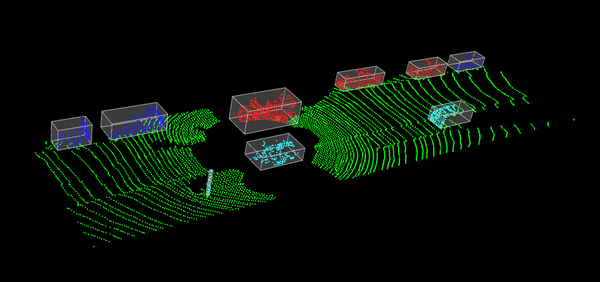

# Point-Cloud-Processing-and-Visualization-with-PCL
A C++ project using the Point Cloud Library (PCL) to demonstrate point cloud processing techniques, including filtering, segmentation, clustering, and visualization. Features include voxel grid filtering, plane segmentation with RANSAC, Euclidean cluster extraction, and rendering of bounding boxes around detected clusters.

## Features

- **Reading PCD Files**: Load point cloud data from PCD files.
- **Filtering**: Apply voxel grid filtering and crop box filtering to downsample and crop point clouds.
- **Plane Segmentation**: Segment planar components from point clouds using RANSAC.
- **Euclidean Cluster Extraction**: Extract clusters from the point cloud.
- **Bounding Box Rendering**: Render bounding boxes around extracted clusters.
- **Visualization**: Visualize point clouds and bounding boxes using PCL's visualization tools.

## Requirements

- PCL (Point Cloud Library)
- Eigen
- Boost
- C++ Compiler

## Getting Started

### Prerequisites

Ensure you have PCL and its dependencies installed. You can follow the installation instructions from the [PCL website](http://www.pointclouds.org/).

### Building the Project

1. Clone the repository:
    ```sh
    git clone https://github.com/TejaswiniDilip18/Point-Cloud-Processing-and-Visualization-with-PCL.git
    cd Point-Cloud-Processing-and-Visualization-with-PCL
    ```

2. Create a build directory and navigate into it:
    ```sh
    mkdir build
    cd build
    ```

3. Configure the project with CMake:
    ```sh
    cmake ..
    ```

4. Build the project:
    ```sh
    make
    ```

### Running the Project

1. Ensure you have point cloud data files in the `data` directory.
2. Run the executable:
    ```sh
    ./Point-Cloud-Processing-and-Visualization-with-PCL
    ```

### Code Overview

- **main.cpp**: Contains the main function and logic for processing and visualizing point clouds.
- **readPCD**: Template function to read PCD files.
- **filterPCD**: Template function to filter point clouds using voxel grid and crop box filters.
- **visualizePCD**: Template function to visualize point clouds.
- **planeSegmentation**: Template function to segment planar regions using RANSAC.
- **euclideanClusterSegmentation**: Template function to extract clusters using Euclidean clustering.
- **bounding_box**: Template function to compute bounding box for clusters.
- **render_box**: Template function to render bounding boxes around clusters.
- **streamPcd**: Function to stream PCD files from a directory.
- **process_pcd**: Function to process and visualize point clouds.

## Output


